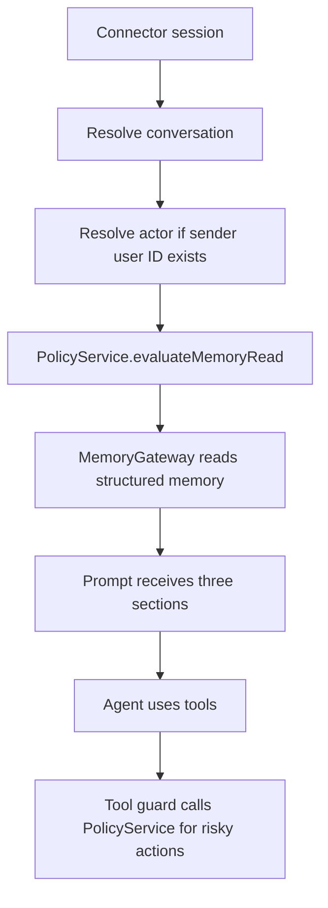

# Policy Service and Three-Layer Memory Design

## Goal

Build a minimal but real business permission boundary before memory and tool context are injected into the agent. Runtime memory must be organized as three visible layers:

1. Enterprise memory
2. Conversation/group memory
3. Employee/personal memory

Old Markdown memory is not retained as runtime fallback. It may only be used later as an explicit migration source that creates reviewable structured memory candidates.

## Current Context

The project already has an admin control plane with structured entities:

- `companies`
- `stores`
- `employees`
- `feishu_conversations`
- `conversation_store_bindings`
- `conversation_members`
- `browser_profiles`
- `browser_profile_permissions`
- `memory_items`
- `memory_entity_links`
- `audit_events`

Before this change, the prompt path injected old Markdown memory through `getMemoryContent(sessionId)` and then appended structured admin memory. That created a confusing mixed source of truth. The new runtime path replaces automatic Markdown memory injection with a `MemoryGateway` that reads structured memory only.

## Decision

Use the existing SQLite admin control plane as the source of truth. Add a small `PolicyService` and a `MemoryGateway` on top of it.

`PolicyService` answers:

- Who is asking?
- Which Feishu group/conversation is this?
- Which company and stores are in scope?
- Which memory layers may be read or written?
- Which browser login states or risky actions require confirmation?

`MemoryGateway` answers:

- Which enterprise memories can this conversation see?
- Which group memories belong to this conversation?
- Which personal memories belong to the sender?
- Which store-bound memory is allowed because the conversation is bound to that store?
- What compact prompt section should be injected?

Store and task are not visible runtime layers. They remain entity links and policy inputs.

## Runtime Flow



## Three Memory Layers

### Enterprise

Enterprise memory contains company-wide SOPs, operating principles, report preferences, escalation rules, and approved business knowledge.

Rules:

- Readable inside active company conversations.
- Writes should be created as review candidates unless the actor is admin or ops lead.
- It must not contain cookies, passwords, tokens, verification codes, or browser storage refs.

### Conversation

Conversation memory contains group-specific context, decisions, campaigns, active store responsibilities, and current operating constraints.

Rules:

- Readable only when the connector ID and conversation ID match.
- Store-linked conversation memory is readable only if the group is bound to that store.
- Writes require the actor to be an active participant or an admin/ops lead.

### Employee

Employee memory contains personal preferences, responsibilities, communication style, and work habits for a specific employee.

Rules:

- Readable only for the active sender, or by admin/ops lead during admin operations.
- Offboarded employees lose runtime memory access.
- Personal memory is not used as business authority for store binding, permissions, or factual metrics.

## Policy Context

The minimal policy context is:

```ts
interface PolicyContext {
  connectorId: string;
  conversationId?: string;
  actorUserId?: string;
  actorEmployeeId?: string;
  companyId?: string;
  storeIds?: string[];
  action: string;
  riskLevel?: 'low' | 'medium' | 'high' | 'critical';
}
```

The minimal policy result is:

```ts
interface PolicyDecision {
  effect: 'allow' | 'deny' | 'requires_confirmation';
  reason: string;
  companyId?: string;
  actorEmployeeId?: string;
  conversationInternalId?: string;
  allowedStoreIds: string[];
  allowedMemoryScopes: Array<'enterprise' | 'conversation' | 'employee'>;
  allowedBrowserProfileIds: string[];
}
```

## Initial Policy Rules

1. Unknown or inactive conversations cannot read conversation memory.
2. Unknown actors cannot read employee memory.
3. Offboarded employees cannot read employee memory or use login-state capabilities.
4. Conversation memory is scoped to the exact internal conversation row.
5. Store-linked memory is readable only for stores actively bound to the current conversation.
6. Enterprise memory is readable for active conversations in the company.
7. Browser profile refs are exposed only as capability labels and IDs, never as storage paths, cookies, tokens, or browser-act IDs.
8. Medium and higher browser-write actions require a policy decision before tool execution.

## MemoryGateway Prompt Output

The prompt should be structured, compact, and explicit:

```text
## 运营上下文
会话: 测试3 (group)
关联门店:
- 趣东北·东北小馆(石岩店)

### 企业记忆
- ...

### 群聊记忆
- ...

### 个人记忆
- ...

### 可用浏览器登录态能力
- 美团主账号 / meituan / 状态:healthy / 风险:high / 最高动作:high_risk_write
```

If a layer has no allowed memory, omit that layer.

## Old Markdown Memory

Old Markdown memory must not be injected by system prompt builders once the structured gateway is active.

Allowed future use:

- Admin-triggered legacy import.
- Import output becomes `memory_items` with `status='pending_review'`.
- Source metadata uses `source_type='legacy_markdown'`.
- Nothing from old Markdown becomes active until approved.

## Implementation Scope

This pass builds the runtime foundation:

1. Add shared policy types.
2. Add `PolicyService`.
3. Add `MemoryGateway`.
4. Route admin prompt context through `MemoryGateway`.
5. Stop normal and Fast mode prompts from injecting old Markdown runtime memory.
6. Keep the old `memory` tool available for manual read/update for now, but remove it from automatic prompt injection.
7. Add focused tests for scoping, offboarding, legacy exclusion, and prompt formatting.

Out of scope for this pass:

- Full admin UI changes.
- Legacy Markdown importer.
- Full tool execution guard for every business tool.
- External mem0 semantic search.

## Testing Strategy

Add tests that prove:

- Structured prompt memory has exactly enterprise, conversation, and employee sections.
- Store-linked memory appears only when the conversation is bound to that store.
- Employee memory appears only when a matching active sender is supplied.
- Offboarded employees lose personal memory access.
- Old Markdown memory is not injected into normal or Fast mode prompt builders.
- Browser capability output excludes secrets, storage refs, and browser-act IDs.

## Migration Notes

Existing `scope='store'` and `scope='task'` memory rows remain valid. They should be treated as entity-linked memory that appears under either enterprise, conversation, or employee sections based on allowed links and policy. New writes should prefer the three visible scopes.
